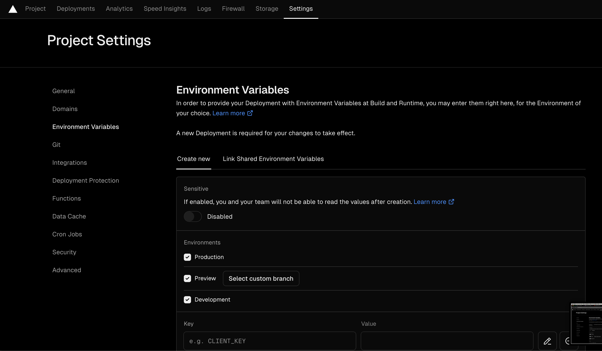

# OpenGuild App

Using NextJS v14.2.5

# How to run.

1. Install packages

```bash
yarn
```

2. Create .env file

3. Run project

```bash
yarn dev
```

# Project Structure


1. /app: This is where to create and configure for pages in Nextjs.
2. /assets: Collections of assets like images.
3. /components: Common, re-usable components.
4. /constants: All constants in the app.
5. /context: Global state.
6. /hooks: Custom hooks for easier stage management
7. /supabase: Configurations, endpoints and functions to interact with Supabase.
8. /utils: Utility functions.

# Env variable

`NETLIFY_NEXT_PLUGIN_SKIP`: env for netlify deployment

`NEXT_PUBLIC_BOT_TOKEN`: Discord bot token

`NEXT_PUBLIC_CLAIM_REQUEST_CHANNEL_ID`: channel ID to send claim request

`NEXT_PUBLIC_DISCORD_API_BASE_URL`: base URL of Discord API 

`NEXT_PUBLIC_DISCORD_AUTH_CLIENT_ID`: Discord Auth Client ID

`NEXT_PUBLIC_DISCORD_AUTH_CLIENT_SECRET`: Discord Auth Client Secret

`NEXT_PUBLIC_GUILD_ID`: Discord Guild ID

`NEXT_PUBLIC_PARTICLE_APP_ID`: Particle App ID, take it in Particle Dashboard

`NEXT_PUBLIC_PARTICLE_CLIENT_KEY`: Particle Client Key, take it int Particle Dashboard

`NEXT_PUBLIC_PARTICLE_PROJECT_ID`: Particle Project ID, take it int Particle Dashboard

`NEXT_PUBLIC_POW_CHANNEL_ID`: channel ID to send PoW

`NEXT_PUBLIC_SUPABASE_KEY`: Supabase `service_role` key, take it in API Settings tab, Project Dashboard

`NEXT_PUBLIC_SUPABASE_URL`: Supabase URL, take it in API Settings tab, Project Dashboard

`NEXTAUTH_SECRET`: A random key for NextAuth deployment

`NODE_VERSION`: node version

# Deployment

1. **Vercel**:

- Deploy following this guideline for NextJS application: https://nextjs.org/learn-pages-router/basics/deploying-nextjs-app/deploy


- Add the _Enviroment Variable_ like below to avoid publibshing the .env file



- Follow this guide to point the custom domain to the vercel page: https://vercel.com/docs/projects/domains/add-a-domain

2. **Netlify**:

- Deploy following this guideline for NextJS application: https://www.netlify.com/blog/2020/11/30/how-to-deploy-next.js-sites-to-netlify/
- Remember to setup as NextJS project
- Make sure there's netlify.toml file with below content (if missing):

  

- Add _Environment Variables_ like Vercel

  

# Others

- Particle Docs: https://developers.particle.network/reference/connect-web
